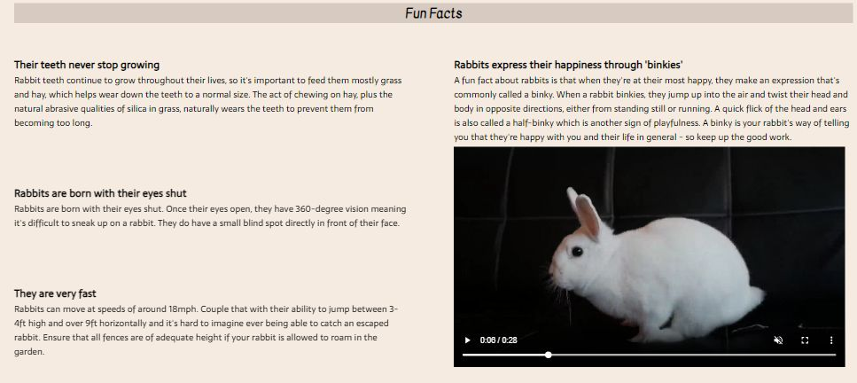
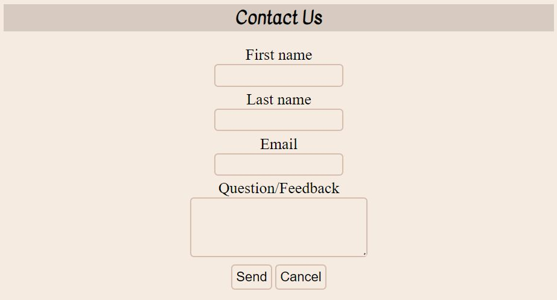

# WORLD'S RABBITS

Worlds rabbit it a site that wants to give knowleadge about the differents rabbits breeds. This site will be targeted towards rabbits owners or any people who wants to have a rabbit pet.

## Features

### Existing Features

- _Navegation Bar_

  - The navegation bar includes links to each section of the website (Info, Fun Facts and Contact Us).
  - Also there is a dropdown menu for the navegation bar on smaller screens.
  - This section will allow the user to easily navigate across all the sections of this website.

    

    

- _Info Section_

  - In this section you will find information about each rabbit, such as a description of its breed, its behavior and its appearance.
  - The goal of this section is to provide information about rabbits and the differences between them for people who want to know more about their own rabbit or for people who are thinking about adopting one.

    

- _Fun Facts Section_

  - In this section you will find curious facts about rabbits.
  - The goal of this section is to increase the reader's interest in rabbits.

    

- _Contact Us Section_

  - In this section there is a form that needs to be filled out correctly in order to be sent.
  - The goal of this section is for the reader to ask us any questions that have not been resolved when reading the page or to give us some feedback.

    

- _Footer_

  - The footer includes links to the social media sites for World's Rabbits. The links will open to a new tab.
  - The footer will allow users to keep connected via social media.

    

## Design

### Wireframe

- This is a hand-draw wireframe of the info site on different screen sizes.
  

### Font and colors

- _Fonts_

  This are the fonts used for this website

  - Amatic SC
  - Kavivanar
  - Sarala

- _Colors_

  This are the color used for this website

  - #36271c
  - #d5bdaf
  - #D7CAC1
  - #f5ebe0
