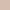
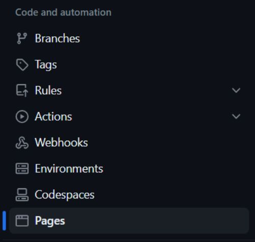

# WORLD'S RABBITS

Worlds rabbit it a site that wants to give knowleadge about the differents rabbits breeds. This site will be targeted towards rabbits owners or any people who wants to have a rabbit pet.

[World's Rabbits](https://paaulcb.github.io/worlds-rabbits/)

## Features

### Existing Features

- _Navegation Bar_

  - The navegation bar includes links to each section of the website (Info, Fun Facts and Contact Us).
  - Also there is a dropdown menu for the navegation bar in smaller screens.
  - This section will allow the user to easily navigate across all the sections of this website.

    

    

- _Info Section_

  - In this section you will find information about each rabbit, such as a description of its breed, its behavior and its appearance.
  - The goal of this section is to provide information about rabbits and the differences between them for people who want to know more about their own rabbit or for people who are thinking about adopting one.

    

- _Fun Facts Section_

  - In this section you will find curious facts about rabbits.
  - The goal of this section is to increase the reader's interest in rabbits.

    

- _Contact Us Section_

  - In this section there is a form that needs to be filled out correctly in order to be sent.
  - The goal of this section is for the reader to ask us any questions that have not been resolved when reading the page or to give us some feedback.

    

- _Footer_

  - The footer includes links to the social media sites for World's Rabbits. The links will open to a new tab.
  - The footer will allow users to keep connected via social media.

    

## Design

### Wireframe

- This is a hand-draw wireframe of the info section in different screen sizes.

  

### Font and colors

- _Fonts_

  This are the fonts used for this website

  - Amatic SC
  - Kavivanar
  - Sarala

- _Colors_

  This are the color used for this website

  - #36271c 
  - #d5bdaf 
  - #d7cac1 
  - #f5ebe0 

## Testing

### Manual testing

- _Resizing_
  - When resize to the differents screen sizes it show the content as intended
- _Navegation bar_
  - When pressing Info it sends you to info section
  - When pressing Fun facts it sends you to Fun facts section
  - When pressing Contact us it sends you to Contact us section
- _Menu on smallers screens_
  - When pressing the menu icon it opens the menu options
    - When pressing Info it sends you to info section
    - When pressing Fun facts it sends you to Fun facts section
    - When pressing Contact us it sends you to Contact us section
  - When pressing the menu icon once the menu options are open it close the menu options
- _Footer_
  - When pressing Facebook logo it opens Facebook in a new tab
  - When pressing Twitter logo it opens Twitter in a new tab
  - When pressing Youtube logo it opens Youtube in a new tab
  - When pressing Instagram logo it opens Instagram in a new tab
  - When pressing Tiktok logo it opens Tiktok in a new tab
- _Contact us form_
  - When pressing Cancel it delete all the text in the form fields.
  - When press Send and one of the fields are empty, it shows a message in the field that's empty requiring to be fill.
  - When pressing send and all the fields are correctly fill, it opens a congratulations page that shows the data that you put in the fields.

### Validator testing

- _HTML_
  - No errors were returned when passing through the official [W3C validator](https://validator.w3.org/nu/?showsource=yes&doc=https%3A%2F%2Fpaaulcb.github.io%2Fworlds-rabbits%2F)
- _CSS_
  - No errors were found when passing through the official [(Jigsaw) validator](http://jigsaw.w3.org/css-validator/validator?lang=en&profile=css3svg&uri=https%3A%2F%2Fpaaulcb.github.io%2Fworlds-rabbits%2F&usermedium=all&vextwarning=&warning=1)
- _Lighthouse report_

  Lighthouse report results that we run in incognito mode

  

### Fixed Bugs

- Pressing any option in the navbar took you where it should but having a sticky header, it covered part of the content. I fixed it by giving this property to the body with the height of the header:
  > scroll-padding-top: 51px;
- On larger screens the content was displayed in a single row instead of showing 2 elements per row. I fixed it using CSS grid instead of flexbox:

  > display: grid;
  >
  > grid-template-columns: auto auto;

### Unfixed Bugs

## Deployment and Local Development

### Deployment

  The site was deployed to GitHub pages. The steps to deploy are as follows:

  1. In the GitHub repository, navigate to the Settings tab.

     

  2. In the left menu go to **Pages**.

     

  3. From the source section drop-down menu, select Deploy from a branch.

     

  4. In the branch section select **main** and folder **/(root)**, then press save.

     

  5. The page will be automatically refreshed with a detailed ribbon display to indicate the successful deployment.

     

### How to clone the repository

1. Go to [World's Rabbits](https://github.com/PaaulCB/worlds-rabbits)
2. Above the list of files, click **Code**.

    

3. Copy the URL for the repository.

    

4. Open Git Bash.
5. Change the current working directory to the location you want the cloned directory.
6. Type **git clone**, and then paste the URL you copied erlier.

         git clone https://github.com/PaaulCB/worlds-rabbits.git

7. Press **Enter** to create your local clone.

    

### How to fork the repository

1. Go to [World's Rabbits](https://github.com/PaaulCB/worlds-rabbits)
2. In the top-right corner of the page, click **Fork**.
   
3. Under "Owner," select the dropdown menu and click an owner for the forked repository.
4. By default, forks are named the same as their upstream repositories. Optionally, to further distinguish your fork, in the "Repository name" field, type a name.
5. Optionally, in the "Description" field, type a description of your fork.
6. Optionally, select **Copy the DEFAULT branch only**.
7. Click **Create fork**.

## Credits

### Content

- The text for the web was taken from:

  - <https://en.wikipedia.org/wiki/Netherland_Dwarf_rabbit>
  - <https://en.wikipedia.org/wiki/Holland_Lop>
  - <https://en.wikipedia.org/wiki/Flemish_Giant_rabbit>
  - <https://en.wikipedia.org/wiki/Silver_Fox_rabbit>
  - <https://en.wikipedia.org/wiki/Cinnamon_rabbit>
  - <https://en.wikipedia.org/wiki/Belgian_Hare>
  - <https://www.medivet.co.uk/pet-care/pet-advice/facts-about-rabbits/>

- The icons in the footer and menu were taken from [Font Awesome](https://fontawesome.com/)
- The page where you send when you fill the form and the code to implement the footer and the dropdown menu was taken from the [love-running project walkthrough](https://github.com/Code-Institute-Solutions/love-running-v3/tree/main/8.1-testing-and-validation)
- The steps to fork a repository were taken from [github docs](https://docs.github.com/en/get-started/quickstart/fork-a-repo)
- The steps to clone a repository were taken from [github docs](https://docs.github.com/en/repositories/creating-and-managing-repositories/cloning-a-repository)
- The template to make this README was taken from [code institute](https://github.com/Code-Institute-Solutions/readme-template/blob/master/README.md)
- [Fontjoy](https://fontjoy.com) was used to choose the font families for this project
- [Coolors](https://coolors.co/) was used to choose the colors for this project
- [Birme](https://www.birme.net/) was used to crop and change the format of the images

### Media

- The images used for this website were taken from:

  - <https://www.reddit.com/media?url=https%3A%2F%2Fpreview.redd.it%2Fnetherlands-dwarf-rabbit-generator-lora-early-beta-i-love-v0-r4if9kq6xlma1.png%3Fwidth%3D584%26format%3Dpng%26auto%3Dwebp%26s%3D94e7689ff27be7b0a62290a449d848d1f2b91354>

  - <https://rabbitinformer.com/wp-content/uploads/2021/12/Cute-Holland-Lop-Rabbit-Outdoors-Large.jpg>
  - <https://gregrichdvm.com/wp-content/uploads/2022/11/holland-lop-Metairie-LA.jpg>
  - <https://www.hepper.com/wp-content/uploads/2023/05/netherland-dwarf-rabbit-on-the-lawn_Preediwat_Shutterstock.jpg>
  - <https://cf.ltkcdn.net/small-mammals/rabbits/images/orig/321388-1600x1066-flemish-giant-rabbit.jpg>
  - <https://petkeen.com/wp-content/uploads/2022/05/flemish-giant-rabbit-on-wooden-floor_mariesacha-Shutterstock-760x507.jpg>
  - <https://ogden_images.s3.amazonaws.com/www.grit.com/images/2010/06/23120839/GRT-JA10-rabbit-silverfox-smithsonian-1.jpg>
  - <https://petkeen.com/wp-content/uploads/2020/11/rabbit-22300_1280-1024x672.jpg>
  - <https://rabbits.life/wp-content/uploads/2021/10/MaxPixel.net-Rabbit-Pet-Animal-1485651-1.jpg>
  - <https://64.media.tumblr.com/faaf0d45cf245cd08272a9e64cc50e78/tumblr_potrwcE7ss1uvq9elo1_640.jpg>
  - <https://www.thepetstep.com/wp-content/uploads/2020/01/Belgian-Hare.jpg>
  - <https://encrypted-tbn3.gstatic.com/images?q=tbn:ANd9GcQTZRZT3Wjb30X6GpL6Wdv5KRAzutWVg4ORb1N5-1ysjg_tPG4B>

- The image used for the favicon was taken from [IMGBIN](https://imgbin.com/png/vpzkPgVN/easter-bunny-rabbit-logo-png)
- The video of this site was taken from [youtube](https://www.youtube.com/watch?v=EgH0pyo5Fbc)
